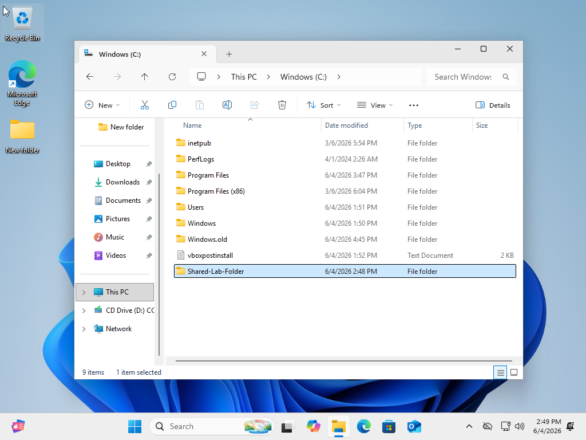
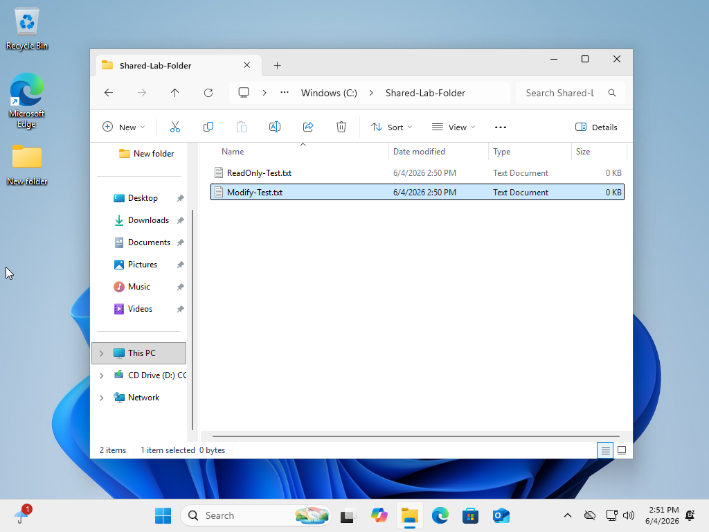
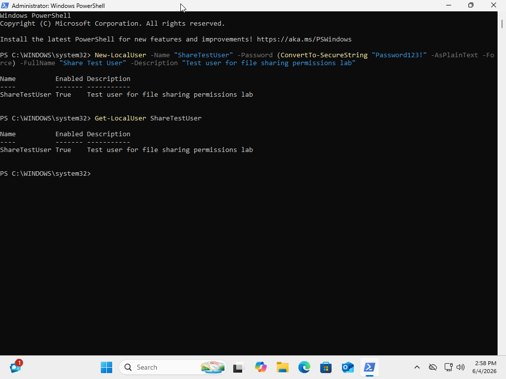
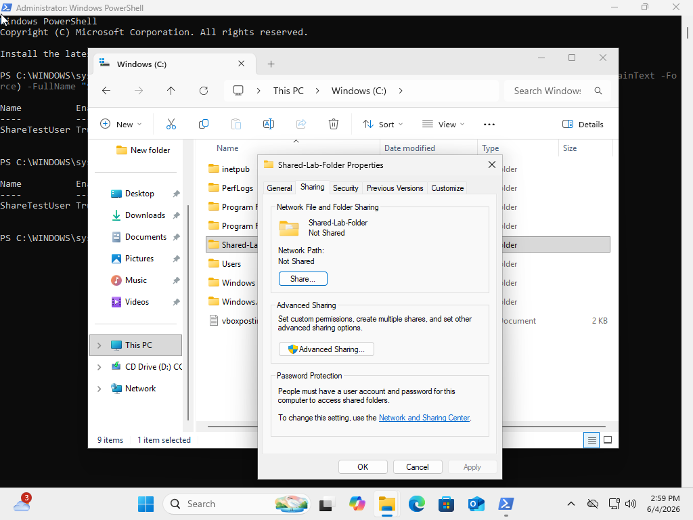
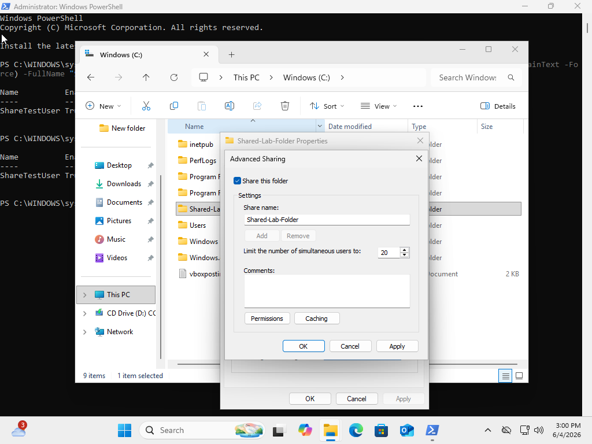
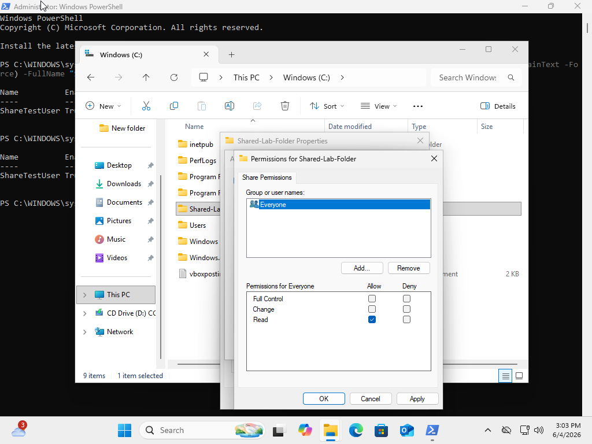
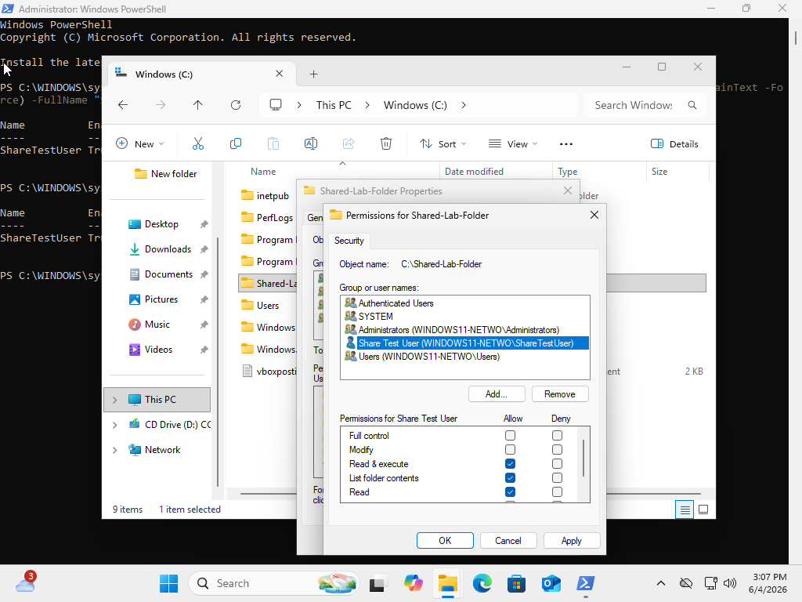
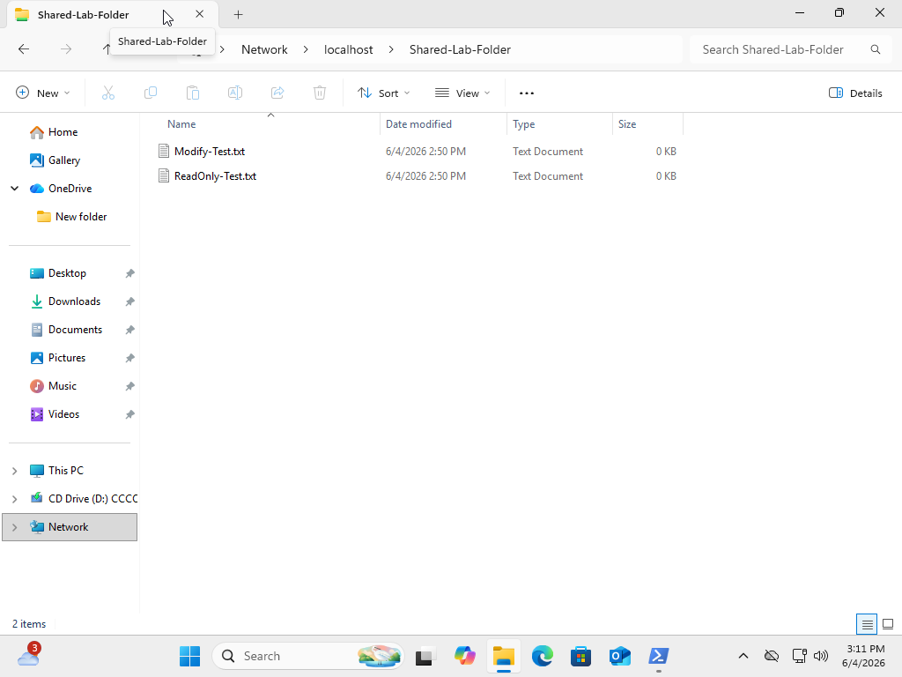
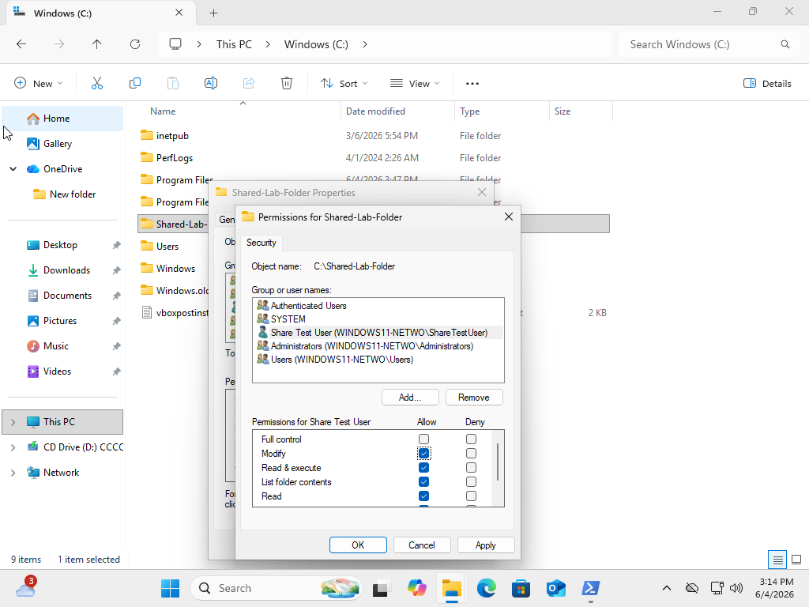
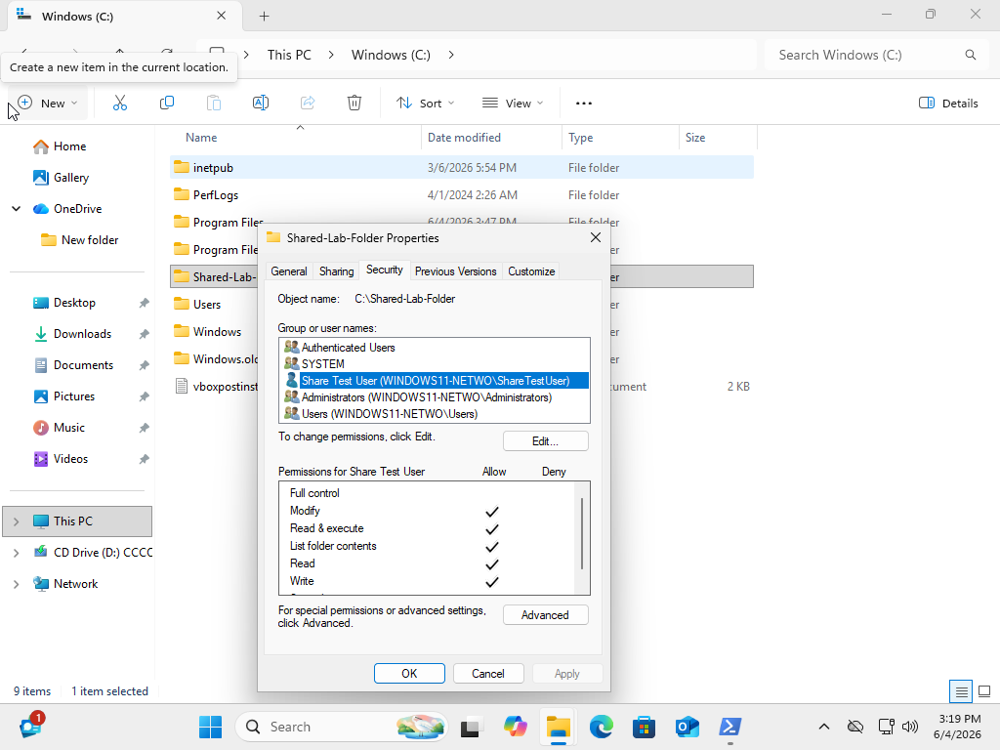

# # Windows File Sharing and Permissions Lab

## Objective

The objective of this lab was to practice creating a shared folder in Windows and configuring both share permissions and NTFS security permissions. This lab demonstrates how to create a test user, share a folder, assign read-only access, access the folder through a network path, and then modify permissions to allow file changes.

## Tools Used

* Windows 11 Virtual Machine
* Oracle VirtualBox
* File Explorer
* Windows Folder Properties
* Advanced Sharing
* Security Permissions
* Windows PowerShell

## Lab Environment

This lab was completed inside a Windows 11 virtual machine running in Oracle VirtualBox. A local folder was created on the C: drive and configured for network sharing and user-based permissions.

## Steps Performed

### 1. Created a Shared Folder

I created a folder named `Shared-Lab-Folder` directly on the C: drive.

Folder path:

```text
C:\Shared-Lab-Folder
```



---

### 2. Created Test Files

Inside the shared folder, I created two test text files:

```text
ReadOnly-Test.txt
Modify-Test.txt
```

These files were used to represent basic files inside a shared directory.



---

### 3. Created a Test User

I opened PowerShell as Administrator and created a local test user named `ShareTestUser`.

Command used:

```powershell
New-LocalUser -Name "ShareTestUser" -Password (ConvertTo-SecureString "Password123!" -AsPlainText -Force) -FullName "Share Test User" -Description "Test user for file sharing permissions lab"
```

I then verified the account using:

```powershell
Get-LocalUser ShareTestUser
```



---

### 4. Opened Folder Sharing Settings

I opened the properties for `Shared-Lab-Folder` and selected the Sharing tab to begin configuring network sharing.



---

### 5. Enabled Advanced Sharing

I opened Advanced Sharing and enabled the option to share the folder. The folder was shared using the name `Shared-Lab-Folder`.



---

### 6. Configured Share Permissions

In the share permissions settings, I selected the `Everyone` group and allowed only Read access. Full Control and Change permissions were not enabled.

This means users accessing the folder through the network share would only have basic read access at the share permission level.



---

### 7. Configured NTFS Security Permissions

I opened the Security tab and added the local user `ShareTestUser` to the folder permissions.

At first, I granted the user read-based permissions:

* Read & execute
* List folder contents
* Read

This allowed the test user to view the folder and its contents without giving modify access.



---

### 8. Accessed the Shared Folder Through the Network Path

I accessed the shared folder using the network path:

```text
\\localhost\Shared-Lab-Folder
```

This confirmed that the folder was available as a network share from the local system.



---

### 9. Changed Permissions to Modify

I returned to the Security permissions and updated the permissions for `ShareTestUser` to allow Modify access.

This gave the user permission to make changes to files inside the shared folder, depending on the combined share and NTFS permissions.



---

### 10. Confirmed Final Permissions

I confirmed that `ShareTestUser` had Modify permissions assigned in the Security tab.



---

## What I Learned

In this lab, I learned how Windows file sharing uses both share permissions and NTFS security permissions. I practiced creating a shared folder, creating a local test user, assigning read-only access, accessing a folder through a network path, and updating permissions to allow modify access.

I also learned that effective access depends on the combination of share permissions and NTFS permissions. This is important in help desk and IT support because users often experience access issues caused by incorrect folder sharing or security permission settings.

## Skills Demonstrated

* Creating shared folders in Windows
* Configuring Advanced Sharing
* Managing share permissions
* Managing NTFS security permissions
* Creating a local user with PowerShell
* Testing network share access
* Understanding Read vs Modify permissions
* Basic Windows file access troubleshooting
* Technical documentation
